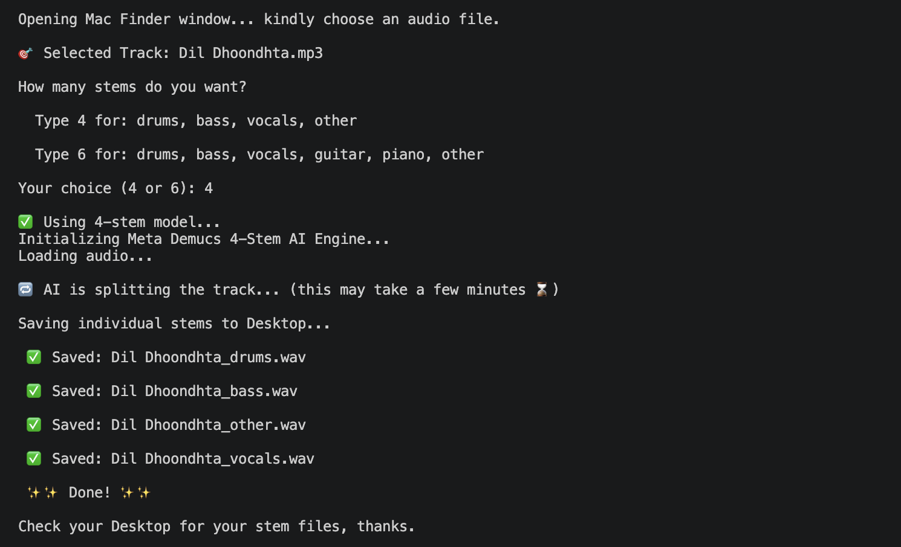

# AI Audio Stem Separator for Vintage Indian Music


## Demo


## What it does
Takes an audio file (.mp3 or .wav) as input and separates it into
individual stems — saved as WAV files on your Desktop.

## Why I built it
Old songs always had soul but lacked the technology.
We finally have it — so why not use it?

## Requirements

### Hardware
Apple Silicon M1 or above

### Software

#### Python 3.9.6 or above

#### Libraries
tkinter (built into Python — no installation needed), torchaudio, torch, demucs

## How to install

1. Install Python 3.9.6 or above from https://www.python.org

2. Then choose one of the following options:

   **Option A — One click installer (recommended):**
   ```bash
      chmod +x run.sh
      ./run.sh
   ```
   This automatically installs libraries and launches the tool.

   **Option B — Manual installation:**
   ```bash
   pip3 install demucs torchaudio torch
   ```
   Then launch the tool:
   ```bash
      python3 stem_sep.py
   ```

## How to use

1. If you have installed any Integrated Development Environment (IDE) like PyCharm or VS Code, open `stem_sep.py` in it, press Run, and skip to step 4.

2. If you have not installed any IDE, open Terminal and navigate
to the folder containing `stem_sep.py` by doing the following steps:
   - Type `cd` followed by a space
   - Drag the folder from Mac Finder directly into Terminal
   - Press Enter

3. Once inside the folder, type:

```bash
python3 stem_sep.py
```

4. A file picker window will pop up.

5. Select your audio file (.mp3 or .wav supported).

6. Choose 4 or 6 stems when prompted:
   - **4 stems** — drums, bass, vocals, other
   - **6 stems** — drums, bass, vocals, guitar, piano, other

7. After a few minutes, processing completes and stem files
appear on your Desktop.

## Output files
Once the processing is done, the following files are generated on the Desktop:

- `song_name_drums.wav` — drums and percussion
- `song_name_bass.wav` — bass
- `song_name_other.wav` — strings, sitars, flutes and all other instruments
- `song_name_vocals.wav` — vocals
- `song_name_guitar.wav` — guitar (6-stem only)
- `song_name_piano.wav` — piano (6-stem only)

## Planned improvements
- Windows support
- One click installer for Windows
- Fine tuning on Indian/Bollywood music
- Improved stem quality with two pass separation
- Noise reduction post processing
- MP3 output option alongside WAV

## Acknowledgements
Built with assistance from Claude (Anthropic) and
Meta's Demucs audio separation model.
